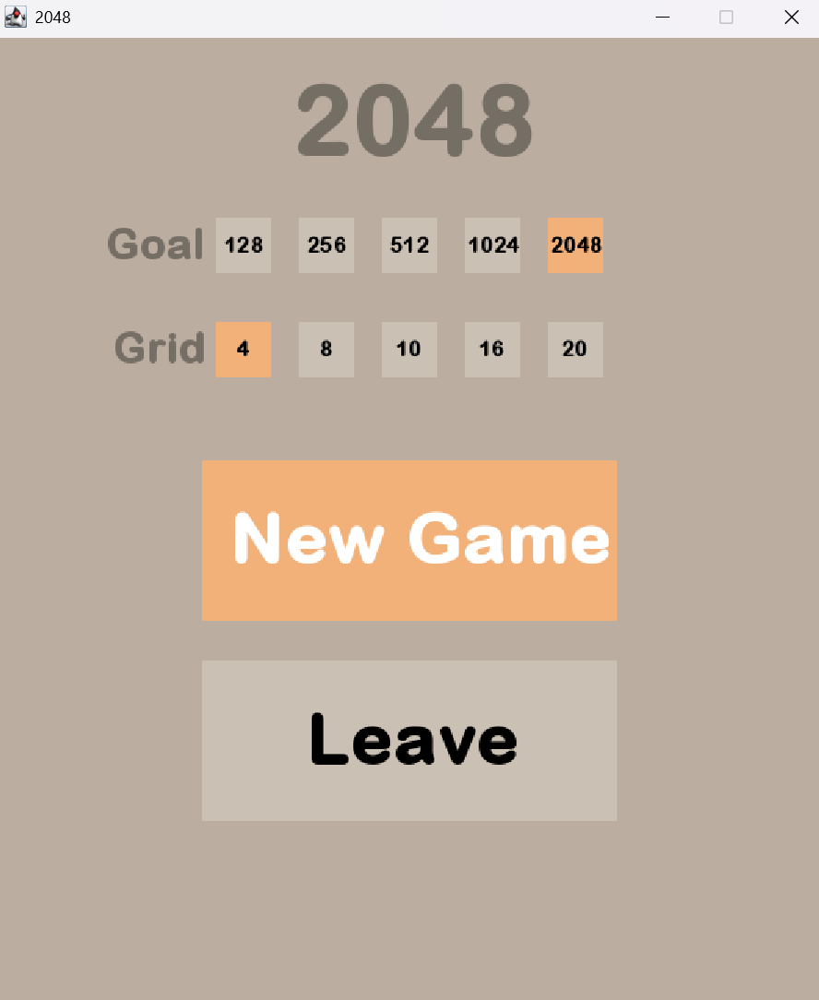

# 2048
Our 2048 game is a 2D grid-based game heavily inspired, if not fully modeled after, the original game of the same name. It was developed in Scala using the FunGraphics library. Random tiles spawn on the grid. Move them, combine them, and aim to reach your goals!

## Table of Content
1. Features
2. Setup
3. Gameplay instructions
4. How the project works

## Features
- **Grid based navigation**: Move cases through the grid
- **Random generation**: Cases generate randomly in the grid
- **Fusion mechanics**: Fusion induced by collisions of identical cases 
- **Game modes**: Choose your game mode, adapt grid size and goals to your play style
- **Graphics and Inputs**: Using the FunGraphics library to display and manage inputs

## Setup
### Prerequisites
- IntelliJ IDEA installed
- Scala plugin in IntelliJ IDEA
- Git installed either on IntelliJ or cmd

### Installation
- Clone the repository
    - Using Terminal (cmd):
        - Navigate to the destination folder using `cd`
        - clone the repo using this command: `git clone https://github.com/Valentin-Monod/2048`
        - Open the project folder with IntelliJ
    - Using IntelliJ
        - New > Project from version control
        - URL: `https://github.com/Valentin-Monod/2048`
        - Choose `Dir` and `Clone`
        - If asked : Trust project
        - In IntelliJ
            - Ensure you're on branch `main`
            - Add the `fungraphics-1.5.15.jar` library to the project
                - Right-click on the file > Add as library
            - Set the `src` directory as the `Source Root`
                - Right-click on the directory > Set directory as > Source Root
            - If needed setup scala sdk (version: `2.13.15`) 

## Gameplay instructions
- Run the Game
    - Choose your goal
      - Default goal set to `2048`
    - Set the grid size
      - Default grid size set to `4`
- When you're ready, press `New game`

- Two tiles are randomly generated on the grid, either a `2` or a `4`

- Move the tiles on the grid using the `W`, `A`, `S`, `D` or arrow keys 
  - Moving the tiles affects every tile on the grid
    - Selecting tiles with the mouse has no effect
  - Two tiles of the same value merge when they come into contact
  - After each move a new tile is generated randomly
    - `2` 90% of the time
    - `4` 10% of the time

- Reach the goal you set to win the game

- You lose if you can’t make any more moves

- The pause menu in the top right corner can be clicked at any time

  - From there, you can either start a `New game`, return `Home` to reset game modes, or exit the game using the `Leave` button

## How the project works

### Front-end

#### Game Loop

The game loop runs continuously during gameplay, managing the different game states and player interactions. Here's how it works:

1. **State Management**: The loop checks the current game state and determines what should be displayed or executed (start, menu, playing, win, lose).
2. **Grid Update**: During the "playing" state, the loop updates the grid and reacts to player input (W, A, S, D for tile movements). The grid is redrawn whenever the tiles are updated.
3. **Game Over Check**: The loop checks if the game is over by calling `checkGame(tab)`. It determines whether the player has won or lost and transitions to the appropriate state.
4. **Frame Rate Synchronization**: The loop ensures the game logic is updated at 60 frames per second to maintain smooth gameplay.

This loop controls the flow of the game and handles all the game logic in real-time.

### Back-end
More practically, the board is made of a 2D `Array` of the custom type `Case`. More practically, the board is made of a 2D Array of the custom type Case. Each Case can have any value that is a power of two, ranging from `2` to `2048`.

#### Functions

### **`drawBackground()`**

The **`drawBackground()`** function is responsible for creating the game's graphical interface each time it is called. It ensures that all visual elements on the game screen are correctly displayed, including the background, title, menu button, and game grid.

1. **Background**: The function begins by clearing the screen and filling it with a background color defined by the `gameBackColor` variable.

2. **Game Title**: The title **"2048"** is displayed at the top of the screen with a stylized font, size 70, and a color specified by the `titleColor` variable.

3. **Menu Button**: A menu button is drawn in the top-right corner of the screen, with a color and size defined by the `btnMenuColor` and `menuBtnSize` variables. This button is enhanced with horizontal lines to improve its visual appearance, indicating that it is clickable.

4. **Game Grid**: The function generates a `gridSize x gridSize` game grid, where each cell is drawn with a color defined by `caseColor`. Each grid cell is placed with margins and padding to ensure proper alignment.

This function sets up the game's visual interface before the user interacts with it, creating a clean and intuitive game environment.

### **`getImage()`**

The **`getImage()`** function is responsible for retrieving the appropriate image for a specific tile in the game based on its value.

1. **Function logic**:
    - The function takes an integer parameter `caseValue`, which represents the value of a tile (e.g., `2`, `4`, `8`, etc.).
    - It calculates the index `i` using the formula `Math.log(caseValue) / Math.log(2)` to determine the power of two that the tile value represents. If the value is `0`, it returns `0` (no image).
    - The index `i` is used to access the corresponding image from the `tabImages` array.

2. **Return value**: The function returns a `GraphicsBitmap`, which is the image associated with the calculated index `i` from the `tabImages` array.

This function is crucial for displaying the correct image on each tile based on its value, ensuring that the visual representation of the game matches the tile values.

### **`drawTab()`**

The **`drawTab()`** function is responsible for drawing the entire game grid (tab) on the screen.

1. **Function logic**:
    - The function takes a 2D array `tabValue` of type `Array[Array[Case]]`, which represents the grid of tiles, where each tile is an instance of the `Case` class.
    - The function loops through the rows (`y`) and columns (`x`) of the `tabValue` array using two nested loops.
    - For each tile in the grid, it calculates the position where the tile should be drawn using the `x` and `y` indices, along with the defined `margin`, `padding`, and `cellSize` values.
    - It uses the **`gameWindow.drawTransformedPicture()`** method to draw the image associated with each tile on the screen. The image is retrieved by calling **`getImage()`**, passing the value of the current tile (`tabValue(y)(x).caseValue`).

2. **Visual Effect**:
    - The tile image is drawn at the calculated position, with the ability to scale it using the `caseFactor` to control the size of the images on the screen.
    - The **`drawTransformedPicture()`** method ensures that the images are drawn correctly with any transformations (such as scaling) applied.

This function is responsible for rendering the entire grid of tiles on the screen, visually representing the current state of the game.

### **`getRandomCases()`**

The **`getRandomCases()`** function is responsible for generating a random empty tile on the game grid and assigning it a value (either `2` or `4`).

1. **Function logic**:
    - The function takes a 2D array `tabValue` of type `Array[Array[Case]]`, which represents the current state of the game grid.
    - A new 2D array `result` is created as a clone of `tabValue` to avoid modifying the original grid.
    - The function checks if there are any empty tiles (tiles with a value of `0`) in the grid. If there are no empty tiles (`check0` becomes `true`), the loop terminates.
    - A loop is used to randomly select an empty tile (a tile with a value of `0`) in the grid. The position of the empty tile is determined by generating random `x` and `y` coordinates within the grid size.
    - Once an empty tile is found, it is assigned a value: `2` with a 90% chance, or `4` with a 10% chance. The function then exits the loop (`check` is set to `true`).

2. **Return value**:
    - The function returns the modified `result` array, which contains the updated grid with a new random tile placed.

This function ensures that the game grid always contains an empty tile for the player to interact with, and randomly assigns a value to the new tile, either `2` or `4`.

### **`checkGame()`**

The **`checkGame()`** function is responsible for checking the current state of the game, determining whether the player has won, lost, or can continue playing.

1. **Function logic**:
    - The function takes a 2D array `tabValue` of type `Array[Array[Case]]`, which represents the current game grid.
    - It initializes the `result` variable to `0`, which indicates the game is still ongoing (playing). The function checks for two conditions: whether the player has won and whether there are any empty tiles (`caseValue == 0`).
    - If a tile with the winning value (`winNumber`) is found on the grid, the game state is set to `1` (win).
    - If no empty tiles are left (`check0 == false`), the function checks if there are any possible tile merges by comparing adjacent tiles (up, down, left, and right). If no merge is possible, the game state is set to `2` (lose).

2. **Return value**:
    - The function returns an integer:
        - `1` if the player has won (a tile with the winning value is found).
        - `2` if the player has lost (no moves or merges are possible).
        - `0` if the game is still ongoing (there are still empty tiles or possible merges).

This function determines the game's outcome by checking for a winning tile, empty tiles, and possible merges, allowing the game to transition between different states (win, lose, playing).

### **`updateTab()`**

The **`updateTab()`** function is responsible for updating the state of the game grid after a move has been made. It moves and merges tiles based on the direction specified by the user (up, down, left, right).

1. **Function logic**:
    - The function takes a 2D array `tabValue` of type `Array[Array[Case]]`, which represents the current state of the game grid.
    - A new 2D array `result` is created as a clone of `tabValue` to avoid modifying the original grid.
    - The function checks the value of `incr`, which determines the stage of the move (either moving or merging).
    - Based on the direction (`down`, `up`, `left`, `right`), the function performs the following operations:
        - **Move operation**: The function shifts the tiles in the specified direction, moving non-zero tiles towards the edge of the grid, and filling empty spaces (represented by tiles with value `0`) with the value from adjacent tiles.
        - **Merge operation**: If two adjacent tiles have the same value and have not already merged, they are combined into one tile with double the original value, and the merged tiles are marked to prevent further merges.

2. **Direction Handling**:
    - The function handles four possible directions: `down`, `up`, `left`, and `right`. For each direction:
        - Tiles are moved in the specified direction.
        - If the move reaches the end of the grid (`incr == gridSize - 1`), the function checks for possible merges.

3. **Return value**:
    - The function returns the updated `result` array, which represents the new state of the grid after the move has been completed.

4. **Post-move actions**:
    - After completing the move, the function checks if the move was completed and resets the necessary variables (such as `incr`, `isUpdating`, and `direction`).
    - If the move is complete, the function generates a new random tile using the **`getRandomCases()`** function and resets the `hasFusionned` flags for all tiles.

This function is essential for handling the mechanics of tile movement and merging in the game, ensuring the grid is updated correctly after each move and maintaining the game state.

### **`drawMenu()`**

The **`drawMenu()`** function is responsible for drawing the main menu of the game, which includes the background, buttons, and status text. This function is called when the game is in the "menu" state.

1. **Function logic**:
    - The function begins by drawing the background of the menu using the specified background color (`menuBackColor`). A filled rectangle is drawn to represent the menu area.

2. **Button Drawing**:
    - **New Game Button**:
        - The "New Game" button is drawn as a filled rectangle with the color `newGameBtnColor`.
        - The button's label "New Game" is displayed using the `drawFancyString()` method with a specific font, size, and color (`Color.white`).
    - **Home Button**:
        - The "Home" button is drawn as a filled rectangle with the color `homeBtnColor`.
        - The button's label "Home" is displayed using the `drawFancyString()` method with the same font, size, and color.

3. **Status Text**:
    - The function checks the state of the game (`start`, `win`, `lose`) and displays an appropriate message:
        - If the game is running, it shows the text "Game running...".
        - If the player has won, it shows "You win!" in a green color (`winColor`).
        - If the player has lost, it shows "You lose!" in a red color (`leaveBtnColorHover`).

4. **Return value**:
    - This function does not return any value; it simply draws elements on the screen to update the game menu.

This function is crucial for rendering the game menu, allowing the player to see the current game status and interact with buttons to start a new game or return home.

### **`drawStart()`**

The **`drawStart()`** function is responsible for rendering the initial screen of the game, which includes the title, goal selection buttons, grid size buttons, and options for starting or leaving the game. This function is called when the game is in the "start" state.

1. **Function logic**:
    - The function begins by clearing the screen and setting the background color (`gameBackColor`).

2. **Title Drawing**:
    - The game's title "2048" is drawn at coordinates `(215, 85)` using the font `"Arial Rounded MT Bold"`, size `70`, and the color `titleColor`.
    - The words "Goal" and "Grid" are displayed with the font `"Arial Rounded MT Bold"`, size `30`, and the color `titleColor` at coordinates `(80, 160)` and `(85, 235)` respectively.

3. **Goal Buttons**:
    - These buttons represent different goal values that the player can aim to reach. Each button is drawn with a specific color and has a number displayed inside it:
        - **Goal 128**: Drawn at coordinates `(160, 130)`, colored with `goal128Color`, displaying the number "128".
        - **Goal 256**: Drawn at coordinates `(220, 130)`, colored with `goal256Color`, displaying the number "256".
        - **Goal 512**: Drawn at coordinates `(280, 130)`, colored with `goal512Color`, displaying the number "512".
        - **Goal 1024**: Drawn at coordinates `(340, 130)`, colored with `goal1024Color`, displaying the number "1024".
        - **Goal 2048**: Drawn at coordinates `(400, 130)`, colored with `goal2048Color`, displaying the number "2048".

4. **Grid Buttons**:
    - These buttons represent different grid sizes that the player can choose from. Each button is drawn with a specific color and has a grid size number displayed inside it:
        - **Grid 4**: Drawn at coordinates `(160, 205)`, colored with `grid4Color`, displaying the number "4".
        - **Grid 8**: Drawn at coordinates `(220, 205)`, colored with `grid8Color`, displaying the number "8".
        - **Grid 10**: Drawn at coordinates `(280, 205)`, colored with `grid10Color`, displaying the number "10".
        - **Grid 16**: Drawn at coordinates `(340, 205)`, colored with `grid16Color`, displaying the number "16".
        - **Grid 20**: Drawn at coordinates `(400, 205)`, colored with `grid20Color`, displaying the number "20".

5. **New Game Button**:
    - The "New Game" button is drawn as a filled rectangle with the color `newGameBtnColor` at the coordinates `(widthScreen / 4, menuScreen + heightScreen / 4 + 30)`.
    - The button's label "New Game" is displayed using the `drawFancyString()` method with a font size of `50` and the color `Color.white`.

6. **Leave Button**:
    - The "Leave" button is drawn as a filled rectangle with the color `leaveBtnColor` at the coordinates `(widthScreen / 4, menuScreen + heightScreen / 2)`.
    - The button's label "Leave" is displayed using the `drawFancyString()` method with a font size of `50` and the color `Color.black`.

7. **Return value**:
    - This function does not return any value; it simply draws elements on the screen to update the start menu.

This function is essential for rendering the initial screen of the game, allowing the player to select goals, grid sizes, and choose whether to start or leave the game.

### **`restart()`**

The **`restart()`** function is responsible for resetting the game state and reinitializing the game board when the player chooses to restart the game. It sets up the game environment, including the grid and the initial game state, so the game can begin afresh.

1. **Function logic**:
    - The function begins by setting the `gameState` to `"playing"`, indicating that the game is in progress.
    - The `direction` is set to `"none"`, meaning no direction is currently selected.
    - The flag `isUpdating` is set to `false`, indicating that the game is not in the process of updating.
    - The `start` flag is set to `true`, signaling that the game has started.
    - The `win` flag is set to `false`, meaning the player has not won yet.
    - The `incr` variable is reset to `0`, which is used for controlling the number of updates made to the game.
    - The game grid `tab` is reinitialized as a 2D array of `Case` objects with the specified grid size (`gridSize`). Each `Case` is initially empty (value `0`).
    - The grid is then populated with random cases by calling the `getRandomCases()` function twice, which generates random `2` or `4` tiles.

2. **Return value**:
    - This function does not return any value. It simply updates the game state, resets the grid, and prepares the game for a new session.

This function is typically called when the player decides to restart the game, ensuring that the game environment is reinitialized and ready for a fresh start.
